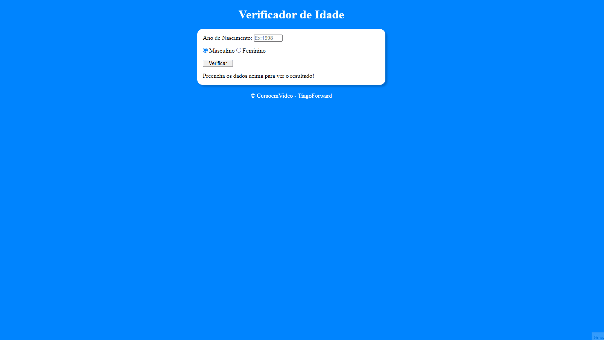
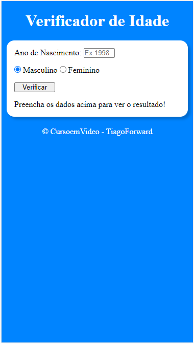

# Desafio Curso em Vídeo | Verificador de idade

## Tabela do Conteudo

<ul>
<li><a href="#sobre">Sobre</a></li>
<li><a href="#status">Status</a></li>
<li><a href="#objetivo">Objetivo</a></li>
<li><a href="#curiosidade">Curiosidade</a></li>
<li><a href="#tecnologias">Tecnologias</a></li>
<li><a href="#acessando-o-site">Acessando o site</a></li>
</ul>

## Sobre

### Layout Desktop | Mobile.

## Status

Concluído! 👌

## Objetivo

Depois de concluir o módulo de JavaScript do Curso em Video, esse é o segundo desafio proposto do curso, desenvolver um site que pudesse adicionar um ano de nascimento, selecionar se o sexo é masculino ou feminino, e exibir na tela o ano atual do sexo selecionado com uma imagem de fundo, utilizando html, css e principalmente javascript.

## Curiosidade

Nessa estrutura, é verificado o ano de nascimento, caso não tenha sido preenchido vai apresentar um erro na tela, o sexo selecionado e irá adicionar também um estilo de BackgroundImage diretamente do JavaScript com a url da imagem! 

Antes de olhar qualquer resolução desse exercício, fiz minha primeira solução básica para resolver esse problema, na qual já foi enviada anteriormente ao meu repositório do GitHub, e agora estou refatorando algumas linhas de código.

## Tecnologias

<ul>
<li>HTML</li>
<li>CSS</li>
<li>JavaScript</li>
<li>GIT BASH</li>
</ul>

## Acessando o site

Para acessar a página, por favor use esse link : <a href="https://tiago-forward.github.io/desafio-verificador-de-idade/" target="_blank">Desafio Curso em Vídeo | Verificador de idade</a>